# Morgan - Autonomous Digital CFO for CorpGen

> Morgan is an enterprise Digital CFO showcase built around the CorpGen digital-worker model: a persistent finance worker with a visible job contract, autonomous 09:00-17:00 operating loop, Microsoft IQ tools, Mission Control proof, Teams/voice presence, cost transparency, and auditable evidence for every meaningful action.

## What is Morgan?

Morgan is a purpose-built autonomous **Digital CFO** for CFO-office workflows, not a general-purpose chatbot. Morgan plans and executes repeatable finance work, explains which instructions she is following, calls tools before making financial claims, records evidence as she works, escalates material risk, and closes the day with a CFO-readable breakdown of completed work, blocked work, and next priorities.

The repository revolves around CorpGen. Morgan treats the CorpGen paper as the operating architecture for an enterprise digital worker: persistent identity, multi-horizon planning, isolated specialist sub-agents, tiered memory, adaptive summarization, cognitive tools, experiential learning, artifact evaluation, and governed communication. Mission Control makes those mechanisms inspectable rather than hidden behind a chat response.

The live implementation includes both a working customer showcase and a production-shaped integration path. Deterministic Contoso finance, WorkIQ, Foundry IQ, and Fabric IQ adapters keep the demo fully working without tenant data. The same tool contracts can be swapped to Graph/Agent 365 MCP, Foundry project assets, Fabric/Power BI semantic models, ERP, and treasury systems for enterprise pilots.

For the fuller operating model, see [docs/corpgen-operating-model.md](docs/corpgen-operating-model.md).

## CorpGen Operating Loop

| CorpGen phase | What Morgan does | Visible proof |
|---|---|---|
| Day Init | Loads CFO priorities, Microsoft IQ context, open blockers, risk watchlist, and next runnable tasks | Mission Control `Today`, `Operating Cadence`, `CFO Operating Plan` |
| Execution Cycle | Runs finance checks, calls tools, refreshes IQ signals, delegates to sub-agents, and records task evidence | Agent Mind, Beta Starfield Live Run, D-CFO Kanban, task records |
| Stakeholder Update | Prepares Teams, email, document, avatar, or Teams-call updates using WorkIQ, Foundry IQ, and Fabric IQ evidence | Microsoft IQ Command Layer, Teams Call Control, Avatar |
| Proof Review | Scores artifacts for purpose, evidence, actionability, governance, and readiness before delivery | Artifact Judge, Foundry metadata, evaluation dataset |
| Day-End Reflection | Produces completed-work breakdown, blocked work, lessons, IQ findings, and next-day priorities | End-of-Day Breakdown, adaptive memory, audit events |
| Monthly Planning | Refreshes strategic, tactical, and operational CFO objectives | CorpGen paper matrix and operating plan |

## Morgan CorpGen Diagrams

The CorpGen paper describes autonomous digital employees with persistent identity, multi-horizon planning, isolated sub-agents, tiered memory, cognitive tools, experiential learning, communication, and evaluation. The diagrams below are Morgan-specific versions of those ideas rather than copies of the paper figures.

### Morgan Digital CFO Workday

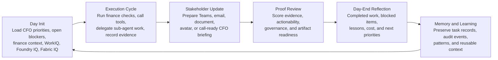

### CorpGen Architecture as Morgan Implements It

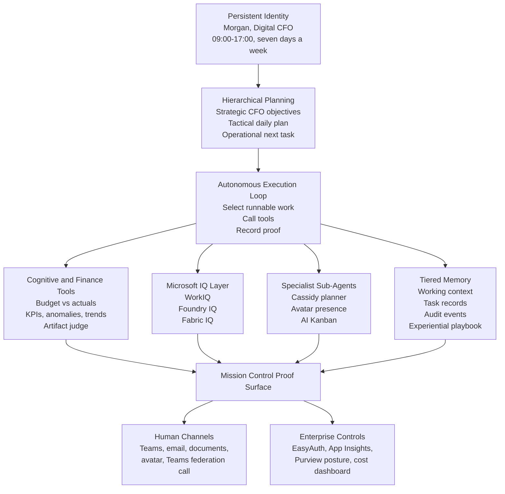

### Microsoft Platform Story

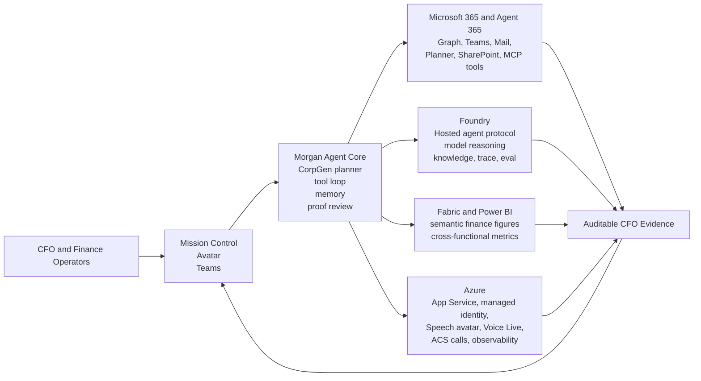

## Showcase Screenshot Walkthrough

The screenshots below are captured from the live Morgan showcase. Together they tell the customer story end-to-end: the digital worker contract, the mind behind the briefings, the instruction set, the enterprise readiness controls, the cognitive toolchain and operating cadence, the autonomous Kanban, the human-facing avatar, and how Morgan appears inside the Microsoft 365 admin surface.

### Mission Control and Beta Starfield

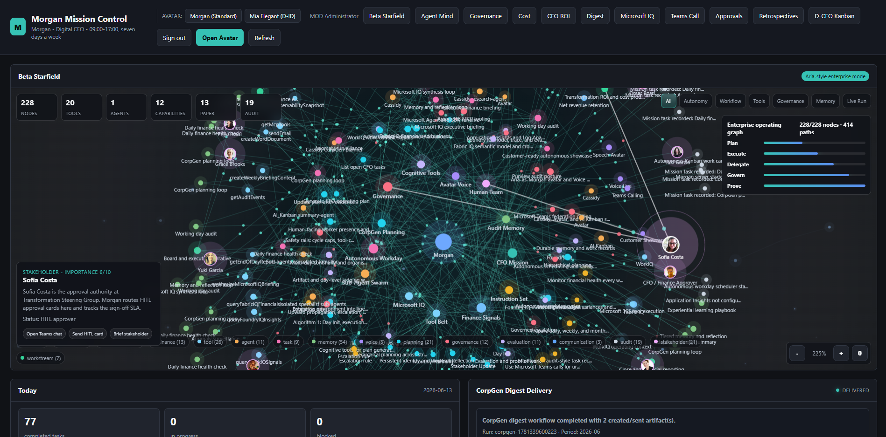

The top of Mission Control shows Morgan's Digital CFO identity, the 09:00-17:00 seven-day work window, the live Beta Starfield operating graph (180 nodes / 318 paths across plan, execute, delegate, govern, prove), today's task counters, and the customer-visible job description. It proves Morgan is a worker with a visible contract, not a hidden chat agent.

### Agent Mind and Microsoft IQ Command Layer

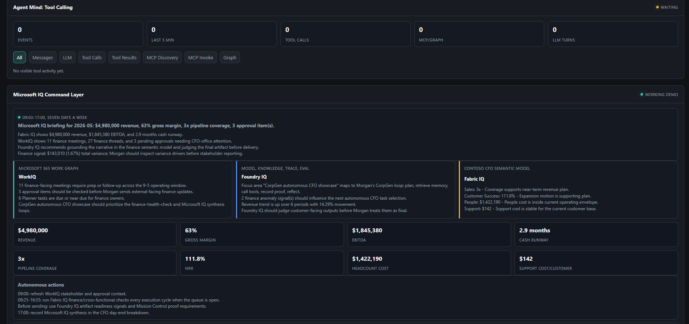

Agent Mind exposes prompts, LLM turns, tool calls, MCP/Graph activity, and tool results in real time. Below it, the Microsoft IQ Command Layer aligns Morgan's CFO briefing with WorkIQ work signals, Foundry IQ model and evaluation context, and Fabric IQ semantic figures (revenue, gross margin, EBITDA, cash runway, NRR, headcount cost), then lists the autonomous actions Morgan will run through the day.

### Instructions and Enterprise Capabilities

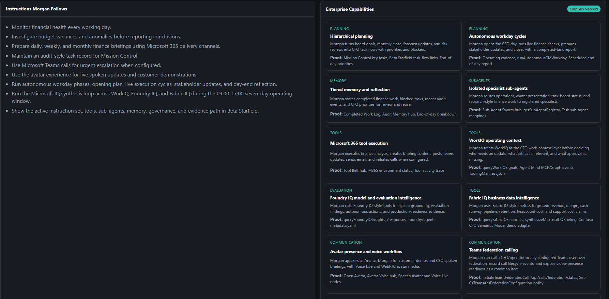

The left panel lists the autonomous instructions Morgan follows; the right panel maps Morgan's enterprise capabilities to the CorpGen architecture (hierarchical planning, autonomous workday cycles, tiered memory, isolated specialist sub-agents, Microsoft 365 tool execution, WorkIQ context, Foundry IQ evaluation, Fabric IQ analytics, avatar presence, Teams federation calling). Each card includes the proof artifact reviewers can inspect.

### Enterprise Readiness

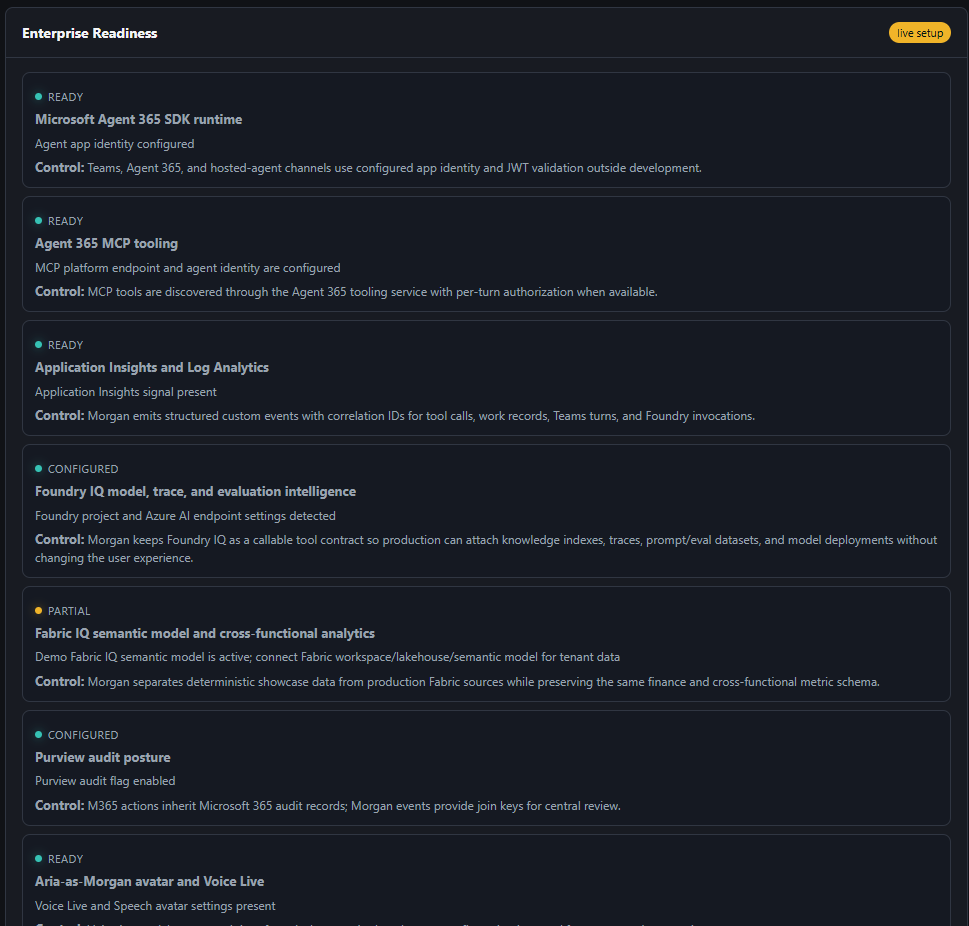

The Enterprise Readiness panel separates ready/configured/partial controls so a customer can see what is genuinely live (Agent 365 runtime, MCP tooling, App Insights, voice avatar) versus what is configured for tenant data (Foundry IQ project, Fabric IQ semantic model, Purview audit posture). Each row states the operational control behind the status.

### Cognitive Toolchain and Operating Cadence

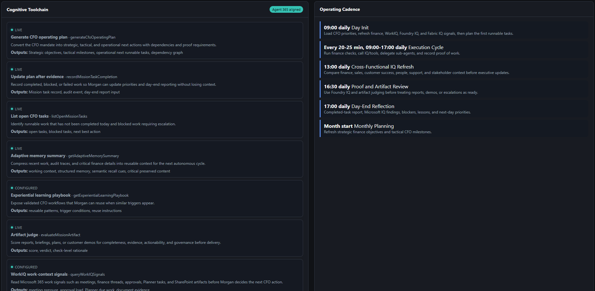

The Cognitive Toolchain lists the live CorpGen-style tools Morgan can call (operating plan generation, mission task completion, open-task selection, adaptive memory summary, experiential learning playbook, artifact judge, WorkIQ signal queries) with their outputs. The Operating Cadence on the right grounds those tools in a real workday: 09:00 Day Init, recurring 20-25 minute Execution Cycles, 13:00 Cross-Functional IQ Refresh, 16:30 Proof and Artifact Review, 17:00 Day-End Reflection, and Monthly Planning at month start.

### Autonomous Kanban (D-CFO Work Board)

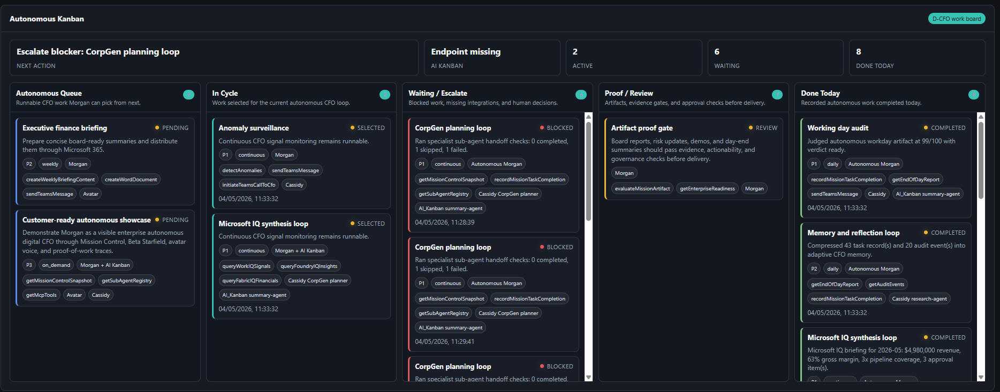

The Autonomous Kanban is the proof-of-work surface. CFO work flows from the autonomous queue into in-cycle execution, with blocked items escalated, artifacts gated through proof/review, and completed work logged in done-today with the sub-agents and tools that ran. This makes Morgan's autonomy auditable rather than opaque.

### Aria-as-Morgan Avatar

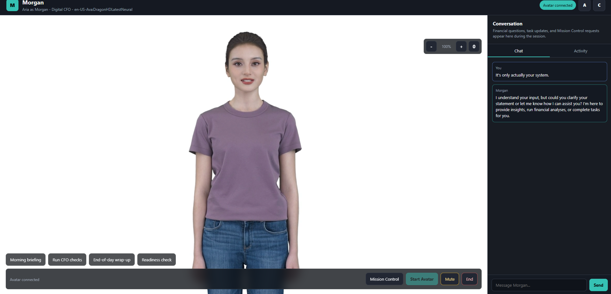

The avatar surface gives Morgan a human-facing presence powered by Azure Voice Live and Speech avatar with WebRTC media. The header pins Morgan's Digital CFO role, quick prompts launch morning briefing / CFO checks / end-of-day wrap-up / readiness check, and the chat panel preserves the spoken conversation as written evidence. A direct link back to Mission Control keeps the underlying work visible and governed.

### Microsoft 365 Admin: Agents and Shadow AI

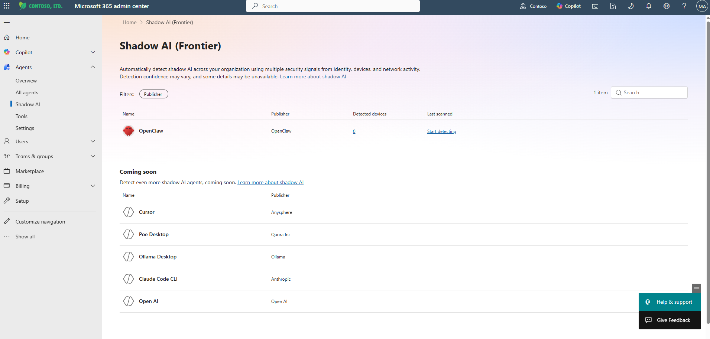

This is how Morgan and other agentic workloads are governed inside the Microsoft 365 admin centre. The Agents node exposes Overview, All agents, Shadow AI, Tools, and Settings, so tenants can detect unsanctioned agents, register approved ones (Morgan included), and apply policy alongside Copilot and the rest of M365. It anchors Morgan to the same admin, identity, and governance surface customers already use.

## Current Live Showcase

- **Production app**: `https://morganfinanceagent-webapp.azurewebsites.net`
- **Azure host**: Linux Azure App Service on Basic B1 with Node.js 20 and WebSockets enabled
- **Mission Control**: `/mission-control` shows Morgan's job description, operating contract, autonomous instructions, key tasks, CorpGen alignment, live task log, day-end summary, D-CFO Kanban, cost panel, Agent Mind, and a cinematic interactive Beta Starfield
- **Agent Mind**: Mission Control exposes live tool calls, Graph/MCP activity, safe reasoning summaries, voice turns, Teams call events, and autonomous task records without exposing hidden chain-of-thought
- **Microsoft IQ Command Layer**: Mission Control shows WorkIQ, Foundry IQ, and Fabric IQ signals in one working CFO briefing, backed by deterministic demo adapters until tenant data is connected
- **Cost of Morgan**: `/mission-control` contains a high-level daily/weekly cost panel, and `/mission-control/costs` drills into Azure actuals plus showback estimates for avatar, Agent 365, Microsoft IQ, Foundry/AI, Fabric IQ, compute, tools, and observability
- **Avatar**: `/voice` and `/avatar` expose Aria as Morgan, backed by Azure Voice Live, Speech avatar relay ICE tokens, WebRTC media, and a blank dark avatar background
- **Interactive Beta Starfield**: the avatar and Mission Control starfields have zoom controls, wheel zoom, drag pan, keyboard reset, cursor-reactive particles, cinematic depth, and state-aware intensity
- **Agent protocols**: `/api/messages`, `/api/agent-messages`, `/responses`, and `/responses/health` support Teams, Agent-to-Agent, and Foundry hosted-agent workflows
- **Health probes**: `/api/health` reports app, voice, avatar, ACS calling, and Mission Control state; `/api/voice/status` reports the voice gate
- **Auth**: browser surfaces use Morgan's Microsoft web sign-in routes (`/auth/login`, `/auth/callback`, `/auth/logout`, `/auth/me`) and accept App Service EasyAuth-compatible principals when present
- **Observability**: Morgan emits structured audit events to stdout and Application Insights when configured, with protected inspection through `/api/observability` and `/api/audit/events`
- **Wiring audit**: `WIRING-GAPS.md` tracks what is now wired in code and what still needs tenant resources, secrets, or external agents

### Key Capabilities

- **Budget vs Actuals Analysis** — Real-time budget variance analysis with anomaly detection
- **Financial KPIs** — Gross Margin, EBITDA, Cash Runway, Burn Rate, Revenue Growth
- **Anomaly Detection** — ML-style severity classification (critical / warning / info)
- **Trend Analysis** — Historical trend calculation with direction and % change
- **Proactive P&L Monitoring** — Automated 25-minute interval P&L alerts via Teams
- **Autonomous Briefings** — Scheduled weekly financial digests generated and distributed without human intervention
- **Mission Control** — Customer-visible job description, autonomous instructions, key tasks, operating cadence, and daily work log
- **CorpGen Paper Alignment** — Mission Control maps Morgan against the CorpGen paper: MHTE/MOMA capabilities, hierarchical planning, isolated sub-agents, tiered memory, adaptive summarization, cognitive tools, experiential learning posture, emergent collaboration, artifact evaluation, and safety rails
- **Next-Gen CorpGen Runtime** — Agent-callable operating plan, open-task selection, adaptive memory summary, experiential learning playbook, enterprise readiness checks, and artifact judge
- **Microsoft IQ Showcase** — Working WorkIQ, Foundry IQ, and Fabric IQ tools for Microsoft 365 work context, Foundry model/eval/knowledge intelligence, Fabric-style financial figures, and cross-functional business insight
- **Beta Starfield** — Aria-style interactive enterprise mode with autonomy, workflow, tools, governance, memory, and live-run views over Morgan's operating graph
- **Agent Mind and Active Starfield** — Active-only live event visibility for prompts, responses, tool calls, MCP/Graph calls, voice sessions, Teams calls, and autonomous task records
- **Cost and Value Transparency** — Daily, weekly, and monthly run-rate model with Azure Cost Management actuals and transparent showback assumptions for the expensive avatar/voice path and platform services
- **End-of-Day Reporting** — Daily completed-task breakdown, blocked work, and next-day priorities for the CFO
- **Avatar Interface** — Real-time spoken avatar via Azure Voice Live, Speech avatar relay, and WebRTC
- **Teams Federation Calling** — Cassidy-style Azure Communication Services bridge that can ring Teams users through ACS-to-Teams federation for urgent finance issues
- **Mission Control Teams Call Control** — EasyAuth-protected operator console for triggering Morgan AI calls without exposing scheduled secrets in the browser
- **Sub-Agent Swarm** — Registry for Cassidy, Avatar, and AI Kanban collaboration endpoints
- **People Lookup** — Microsoft Graph integration to resolve names to email addresses
- **Cross-Channel Control** — Enable/disable avatar voice interface from Teams chat

## Architecture

```
┌──────────────────────────────────────────────────────────────────────┐
│                          Morgan Agent                                │
│                                                                      │
│  ┌────────────┐   ┌──────────────┐   ┌──────────────────────────┐  │
│  │ Teams Chat │   │  Agent Core  │   │      Tool Registry       │  │
│  │  (Agentic  │──▶│ (GPT-5 +     │──▶│  analyzeBudgetVsActuals  │  │
│  │   Auth)    │   │  ReAct loop) │   │  getFinancialKPIs        │  │
│  └────────────┘   │              │   │  detectAnomalies         │  │
│                   │  System      │   │  calculateTrend          │  │
│  ┌────────────┐   │  Prompt +    │   │  lookupPerson (Graph)    │  │
│  │ Voice Live │──▶│  Persona     │   │  sendEmail (MCP)         │  │
│  │ (Browser)  │   │              │   │  sendTeamsMessage (MCP)  │  │
│  └────────────┘   └──────────────┘   │  createWordDocument (MCP)│  │
│                          │           │  readSharePointData (MCP)│  │
│  ┌────────────┐          │           └──────────────────────────┘  │
│  │  Scheduler │──────────┘                                         │
│  │ (25-min    │                                                    │
│  │  interval) │                                                    │
│  └────────────┘                                                    │
└──────────────────────────────────────────────────────────────────────┘
         │                    │                        │
         ▼                    ▼                        ▼
  ┌─────────────┐   ┌──────────────┐          ┌──────────────┐
  │ Azure OpenAI│   │  Voice Live  │          │  MCP Servers  │
  │   (GPT-5)  │   │  (HD Voice)  │          │ (Mail/Teams/  │
  └─────────────┘   └──────────────┘          │  SharePoint)  │
                                              └──────────────┘
```

## Tech Stack

| Component | Technology |
|---|---|
| Agent Runtime | Microsoft Agents SDK (`@microsoft/agents-hosting`) |
| LLM | Azure OpenAI GPT-5 |
| Voice | Azure Voice Live API + HD Neural Voice (Ava) |
| Hosting | Azure App Service (Node.js 20) |
| Hosted Agent | Microsoft Foundry Hosted Agent container (`/responses` protocol) |
| Auth | Azure Managed Identity + DefaultAzureCredential |
| Chat Channel | Microsoft Teams (Agentic Auth) |
| Voice Channel | Browser WebSocket → server-side Voice Live proxy |
| Proactive Alerts | In-process interval timer → Teams `continueConversation` |
| Tool Extension | MCP (Model Context Protocol) via Agent 365 |
| Observability | Application Insights, Morgan audit events, Foundry eval artifacts |
| Audit | Microsoft Purview audit posture for Agent 365/M365 actions + exported Morgan custom events |
| People Search | Microsoft Graph API (`User.Read.All`) |

## Project Structure

```
Morgan-D-CFO/
├── src/
│   ├── index.ts              # Express server, routes, HTTP/WS setup
│   ├── agent.ts              # Agent message handler, LLM agentic loop
│   ├── persona.ts            # Morgan's system prompt and briefing prompt
│   ├── tools/
│   │   ├── index.ts          # Tool registry, dispatcher, autonomous briefing
│   │   ├── financialTools.ts # Budget analysis, KPIs, anomalies, trends
│   │   ├── iqTools.ts        # WorkIQ, Foundry IQ, Fabric IQ demo adapters and synthesis
│   │   ├── reportTools.ts    # Report formatting, Teams formatting
│   │   └── mcpToolSetup.ts   # MCP integration, email, people lookup (Graph)
│   ├── scheduler/
│   │   ├── autonomousWorkdayScheduler.ts # 09:00-17:00 autonomous CFO loop
│   │   ├── proactiveMonitor.ts           # 25-min P&L monitoring via Teams
│   │   └── pnlMessages.ts                # Dynamic P&L message generation
│   ├── mission/
│   │   ├── missionControl.ts    # Job description, key tasks, CorpGen loop, EOD report
│   │   ├── mindmap.ts           # Beta Starfield / Agent Mind graph data
│   │   ├── costModel.ts         # Cost/value dashboard model with Azure actuals
│   │   ├── mission-control.html # Customer-facing Mission Control dashboard
│   │   └── cost-dashboard.html  # Detailed Morgan cost dashboard
│   ├── orchestrator/
│   │   └── subAgents.ts        # Cassidy / Avatar / AI Kanban registry + calls
│   ├── observability/
│   │   ├── agentAudit.ts       # Audit events and Application Insights integration
│   │   └── agentEvents.ts      # Agent Mind event stream
│   ├── foundry/
│   │   └── responsesAdapter.ts # Foundry hosted-agent Responses protocol
│   ├── storage/
│   │   └── agentStorage.ts     # Cosmos-backed Agent SDK state when configured
│   └── voice/
│       ├── voiceProxy.ts     # WebSocket proxy to Azure Voice Live
│       ├── voiceTools.ts     # Voice-specific tool definitions
│       ├── voiceGate.ts      # Enable/disable voice via Teams commands
│       ├── avatarRoutes.ts   # Speech avatar relay token + avatar config endpoints
│       ├── acsBridge.ts      # ACS Teams call bridge to Azure OpenAI realtime
│       └── voice.html        # Browser avatar UI, transcript, mute, Mission Control link
├── azure-function-trigger/   # Azure Functions timer trigger (weekly briefing)
├── docs/                     # CorpGen architecture and capability documentation
├── .foundry/                 # Foundry metadata, evaluator seeds, datasets, results
├── agent.yaml                # Hosted agent manifest for Foundry
├── Dockerfile                # Linux AMD64 hosted-agent container
├── manifest/                 # Teams app manifest
├── publish/                  # Deployment package (pre-compiled)
├── .env.template             # Environment variable template
├── package.json
└── tsconfig.json
```

## Route Map

| Route | Purpose | Protection |
|---|---|---|
| `/mission-control` | Main Morgan Mission Control surface: job contract, CorpGen loop, Agent Mind, Starfield, IQ, D-CFO Kanban, Teams call control, cost panel, EOD report | Microsoft web sign-in / EasyAuth-compatible principal |
| `/mission-control/costs` | Detailed cost and value dashboard | Microsoft web sign-in / EasyAuth-compatible principal |
| `/voice` and `/avatar` | Aria-as-Morgan avatar and Voice Live UI | Microsoft web sign-in / EasyAuth-compatible principal |
| `/api/mission-control` | Mission Control JSON snapshot used by UI and tools | EasyAuth |
| `/api/mission-control/events` | Agent Mind event stream for tool/MCP/Graph/voice/Teams/task visibility | EasyAuth |
| `/api/mission-control/costs` | Cost/value model with Azure actuals and estimates | EasyAuth |
| `/api/mission-control/run-workday` | Scheduled autonomous CFO execution cycle | `SCHEDULED_SECRET` |
| `/api/mission-control/teams-call` | Browser-triggered Teams federation call | EasyAuth |
| `/api/voice/invite` | Secret-protected Teams call trigger for automation | `SCHEDULED_SECRET` |
| `/api/calls/acs-events`, `/api/calls/incoming`, `/api/calls/acs-media` | ACS Teams call lifecycle, inbound call, and media bridge | ACS callback/WebSocket path plus app controls |
| `/responses` and `/responses/health` | Foundry hosted-agent Responses protocol and health probe | Hosted-agent / route-level runtime controls |
| `/api/observability` and `/api/audit/events` | App Insights, Purview posture, and audit event inspection | `SCHEDULED_SECRET` |

## Features in Detail

### Mission Control

Morgan exposes a customer-facing Mission Control surface at `/mission-control`:

- Morgan's Digital CFO job description and operating contract
- Customer-visible autonomous instructions
- Key tasks, cadence, triggers, expected outputs, tools, and sub-agents
- Microsoft IQ command layer: WorkIQ work context, Foundry IQ insights/evaluation signals, Fabric IQ financial and cross-functional figures, and production cutover path
- Cost of Morgan: high-level daily/weekly run-rate, avatar cost share, value-to-cost estimate, and a drill-down dashboard at `/mission-control/costs`
- Autonomous D-CFO Kanban with queue, in-cycle, waiting/escalation, proof-review, and done-today lanes
- Cognitive toolchain: CFO operating plan, open-task review, adaptive memory, experiential learning, readiness checks, and artifact evaluation
- Enterprise readiness checks for Agent 365 SDK, MCP, Application Insights/Log Analytics, Purview posture, avatar presence, sub-agent endpoints, durable memory, and scheduler safety
- Today's completed, in-progress, blocked, and failed task log
- End-of-day breakdown for the CFO

Mission Control is backed by the same `missionControl.ts` module used by Morgan's tools, so it reflects the instructions and task records Morgan is actually using.

The cost dashboard is backed by `/api/mission-control/costs`. It queries Azure Cost Management for the Morgan resource group when the App Service identity has Cost Management access, then combines those actuals with transparent showback assumptions for Agent 365, Microsoft IQ, Fabric/Power BI, Graph/MCP tool calls, and realtime avatar usage. For actuals, assign the App Service identity Cost Management Reader plus Reader, or use the narrow `Morgan Cost Query Reader` custom role with `Microsoft.CostManagement/query/read` at the Morgan resource-group or subscription scope. Tune the model with `MORGAN_COST_*` and `MORGAN_VALUE_*` app settings such as `MORGAN_COST_AVATAR_SESSION_MINUTE`, `MORGAN_COST_AGENT365_DAILY`, `MORGAN_COST_FABRIC_QUERY`, `MORGAN_VALUE_FINANCE_HOURLY_RATE`, and `MORGAN_VALUE_HOURS_PER_COMPLETED_TASK`.

The dashboard also includes a CorpGen paper match matrix. Each row shows the paper concept, Morgan's implementation, the enterprise control expected for real deployments, current status, and proof points. Items marked `production-hardening` are intentionally visible rather than hidden: durable storage, artifact judging, and organization-scale runs need enterprise backing services before they should be represented as fully production-complete.

The current implementation goes beyond a static paper mapping. Morgan can call `generateCfoOperatingPlan`, `listOpenMissionTasks`, `getAutonomousKanbanBoard`, `getAdaptiveMemorySummary`, `getExperientialLearningPlaybook`, `getEnterpriseReadiness`, `evaluateMissionArtifact`, `queryWorkIQSignals`, `queryFoundryIQInsights`, `queryFabricIQFinancials`, and `synthesizeMicrosoftIQBriefing` during real turns, voice sessions, and autonomous workday runs. These tools make the showcase inspectable: customers can see what Morgan plans to do, why it chose the next task, what is on the autonomous Kanban board, what memory it preserved, which enterprise controls are ready, which IQ sources informed the business insight, and whether an artifact is good enough to present.

Morgan's autonomous CFO operating window is `09:00-17:00`, seven days a week. The App Service can run this loop in process when `AUTONOMOUS_WORKDAY_ENABLED=true`, and the scheduled endpoints can trigger the same workday loop from an external Function App. Mission Control shows the cadence, task evidence, and day-end priorities.

The Azure Functions trigger app now contains three scheduler paths into Morgan:

- `dailyAnomalyCheck` at 09:00 every day posts to `/api/scheduled`.
- `autonomousWorkdayCycle` runs every 25 minutes from 09:00 through 16:50 every day and posts to `/api/mission-control/run-workday`.
- `endOfDayReport` runs at 17:00 every day and posts to `/api/scheduled/end-of-day`.

Configure the Function App with `MORGAN_AGENT_URL`, the same `SCHEDULED_SECRET` as the Morgan App Service, and `WEBSITE_TIME_ZONE` when the 09:00-17:00 window should follow local business time rather than UTC.

For the in-process App Service scheduler, configure `AUTONOMOUS_WORKDAY_ENABLED`, `AUTONOMOUS_WORKDAY_TIME_ZONE`, `AUTONOMOUS_WORKDAY_START_HOUR`, `AUTONOMOUS_WORKDAY_END_HOUR`, and `AUTONOMOUS_WORKDAY_INTERVAL_MINUTES`. `/api/health` reports the live scheduler status.

### Avatar Interface (Azure Voice Live + Speech Avatar)

Morgan has a browser-based avatar interface powered by Azure Voice Live API and Azure Speech avatar relay:

- **HD Neural Voice** — `en-US-Ava:DragonHDLatestNeural` for natural speech output
- **WebRTC Avatar** — Speech avatar relay token endpoint at `/api/avatar/ice`
- **Semantic VAD** — Azure semantic voice activity detection for accurate turn-taking
- **Barge-in Support** — Interrupt Morgan mid-sentence; she stops immediately and responds to the new input
- **Noise Suppression** — Server-side `azure_deep_noise_suppression`
- **Echo Cancellation** — Server-side `server_echo_cancellation`
- **Browser Audio Capture** — High-quality mic capture with linear interpolation resampling
- **Mute Button** — Disable mic during noisy environments
- **Mission Control Link** — Jump directly from avatar to the live job-description dashboard
- **Blank Avatar Background** — Voice Live avatar video defaults to a clean white backdrop (`AVATAR_BACKGROUND_COLOR`, default `#FFFFFF`) and renders the raw HD video stream directly so detail is preserved at full resolution. Set the env var to a darker preset (e.g. `#000000`) to switch on the keying compositor and matte the avatar onto a dark stage.
- **Interactive Starfield** — Wheel or button zoom, drag pan, reset, cursor-reactive particle links, and state-aware intensity while Morgan listens, thinks, and speaks
- **Aria-Style Avatar Shell** — Chat and Activity tabs, prompt chips, text composer, avatar/camera presets, background swatches, accessible mode, text-size controls, high contrast, aura states, quick-launch prompts, and a live tool-call overlay
- **Showcase Session Guard** — Morgan keeps one active avatar session per app instance and disconnects stale duplicate tabs so Speech avatar capacity is not exhausted during demos

**Voice Gate**: Voice is disabled by default. Enable/disable from Teams:
- `"enable avatar"` or `"enable voice"` — Activates the avatar page
- `"disable avatar"` or `"disable voice"` — Shows professional offline screen to visitors
- `"avatar status"` or `"voice status"` — Check current state

### Teams Federation Calling

Morgan includes a Cassidy-style ACS bridge for proactive Microsoft Teams calls through ACS-to-Teams federation:

- `POST /api/voice/invite` places an outbound call to a Teams user AAD object ID using `microsoftTeamsUserId`
- `POST /api/calls/acs-events` receives ACS call lifecycle callbacks
- `POST /api/calls/incoming` handles Event Grid validation and can answer inbound ACS incoming-call events
- `wss://<host>/api/calls/acs-media` bridges ACS bidirectional audio to Azure OpenAI realtime
- `GET /api/calls/status` shows configured state and active call snapshots
- `GET /api/calls/federation/status` shows the ACS federation readiness, tenant policy command, and video-presence roadmap
- `GET /api/mission-control/teams-call/status` and `POST /api/mission-control/teams-call` power the browser Mission Control call console with Microsoft sign-in protection

Configure `ACS_CONNECTION_STRING`, `ACS_SOURCE_USER_ID`, `CFO_TEAMS_USER_AAD_OID`, `BASE_URL`, `PUBLIC_HOSTNAME`, and `AZURE_OPENAI_REALTIME_DEPLOYMENT` to enable live calls. The Cassidy fix also requires the tenant-side federation policy to allow the ACS resource:

```powershell
Set-CsTeamsAcsFederationConfiguration -EnableAcsUsers $true `
   -AllowedAcsResources @{Add='<ACS resource id>'}
```

Store the allowed resource marker in `ACS_TEAMS_FEDERATION_RESOURCE_ID` so Mission Control and `/api/calls/federation/status` can show that the federation policy has been applied. Morgan can use `initiateTeamsCallToCfo` for the CFO/operator shortcut or `initiateTeamsFederatedCall` for a governed call to any supplied Teams user object ID.

Morgan's current Teams federation bridge is live bidirectional audio. Showing Aria-as-Morgan as a moving video feed inside Teams is the next media workstream: it needs a Teams-compatible video sender path, such as an ACS Calling SDK video client that joins the call/meeting or a Teams media bot path if true media injection is required.

### Foundry Hosted Agent

Morgan is packaged for Microsoft Foundry Hosted Agent deployment:

- `Dockerfile` builds the Node.js 20 container and exposes port `8088`
- `agent.yaml` declares Morgan as a hosted agent with `responses:v1` and `a2a:v1` protocols
- `.foundry/agent-metadata.yaml` stores the target environment, agent name, ACR, observability, Purview audit posture, and P0 test cases
- `POST /responses` provides a Responses-compatible hosted-agent endpoint
- `GET /responses/health` provides the hosted-agent readiness probe

Build images for Foundry with `--platform linux/amd64` and use a timestamped image tag when pushing to Azure Container Registry.

### Observability and Audit

Morgan emits structured audit events for Teams turns, Foundry `/responses` turns, tool calls, Mission Control task records, server startup, and failures. Events are written to stdout and, when `APPLICATIONINSIGHTS_CONNECTION_STRING` is set, to Application Insights custom events.

Secret-protected inspection endpoints:

- `GET /api/observability` — Application Insights, Agent 365, and Purview audit readiness status
- `GET /api/audit/events` — recent Morgan audit events with correlation IDs

For Microsoft Purview:

- M365 actions performed through Agent 365/MCP/Graph inherit Microsoft 365 auditability under the executing user/app identity.
- Morgan custom events use `correlationId` so they can be joined with Entra, Teams, Exchange, SharePoint, and Agent 365 audit records.
- Export Application Insights to Log Analytics and connect the audit review workspace to your Purview/Sentinel governance workflow for centralized review.

### Proactive P&L Monitoring

Say `"start monitoring"` in Teams and Morgan sends financial updates every 25 minutes:
- Revenue, margin, and expense movements with trend indicators
- Anomaly alerts with severity classification
- Dynamic messages that vary each cycle (variance spotlights, margin analysis, expense breakdowns)

### People Lookup (Microsoft Graph)

Morgan can resolve names to email addresses using Microsoft Graph:
- Ask: *"Email Sarah the budget report"*
- Morgan calls `lookupPerson({ name: "Sarah" })` → resolves to full email address
- Then sends the email with the correct recipient

### MCP Integration (Agent 365)

Morgan connects to Microsoft 365 services via MCP servers:
- **Mail** — Send emails on behalf of the finance team
- **Teams** — Post messages to channels
- **SharePoint** — Read financial data from document libraries
- **Word** — Create formatted reports
- **OneDrive, Calendar, Planner, Excel** — Additional capabilities via MCP

## Tools Reference

| Tool | What It Does | Parameters |
|---|---|---|
| `analyzeBudgetVsActuals` | Budget vs actual spend comparison with variance flags | `period` (required), `category` (optional) |
| `getFinancialKPIs` | Gross Margin %, EBITDA, Cash Runway, Burn Rate, Revenue Growth % | `period` (required) |
| `detectAnomalies` | Scan for variance beyond threshold; severity-classified alerts | `period`, `threshold_percent` (both required) |
| `calculateTrend` | Historical trend for any metric over N months | `metric`, `periods` (both required) |
| `lookupPerson` | Search for a person by name via Microsoft Graph | `name` (required) |
| `sendEmail` | Send email via M365 Mail (MCP) | `to`, `subject`, `body` (required) |
| `sendTeamsMessage` | Post to a Teams channel (MCP) | `channel_id`, `message` (required) |
| `generateCfoOperatingPlan` | Strategic, tactical, and operational CFO plan with dependencies, escalation queue, and proof requirements | — |
| `listOpenMissionTasks` | Open/blocked Mission Control tasks and next best autonomous CFO action | — |
| `queryWorkIQSignals` | Microsoft 365 work-context signals for meetings, finance threads, approvals, Planner due work, and SharePoint artifacts | `period`, `focus` |
| `queryFoundryIQInsights` | Foundry-style model, knowledge, trace, evaluation, and artifact-readiness insight | `period`, `focus` |
| `queryFabricIQFinancials` | Fabric-style semantic-model finance figures and cross-functional business metrics | `period`, `business_unit` |
| `synthesizeMicrosoftIQBriefing` | Combined WorkIQ, Foundry IQ, and Fabric IQ CFO briefing with evidence and autonomous actions | `period`, `audience`, `focus` |
| `getAutonomousKanbanBoard` | D-CFO autonomous Kanban lanes for queued, active, waiting, proof-review, and completed work | — |
| `getAdaptiveMemorySummary` | Working context, structured task memory, critical content, and compression policy | — |
| `getExperientialLearningPlaybook` | Reusable CFO workflow patterns learned from task records and the showcase path | — |
| `getEnterpriseReadiness` | Agent 365, MCP, observability, Purview, avatar, sub-agent, durable-memory, and scheduler readiness checks | — |
| `evaluateMissionArtifact` | Scores reports, plans, demo scripts, and day-end summaries for evidence, actionability, governance, and readiness | `content` (required), `artifact_type`, `title`, `evidence` |
| `getTeamsFederationCallingStatus` | Teams federation readiness, active ACS calls, tenant federation command, and video-presence roadmap | — |
| `initiateTeamsFederatedCall` | Rings a supplied Microsoft Teams user over ACS-to-Teams federation | `reason`, `teams_user_aad_oid`, `target_display_name`, `requested_by`, `instructions` |
| `initiateTeamsCallToCfo` | Rings the configured CFO/operator over ACS-to-Teams federation | `reason`, `teams_user_aad_oid`, `requested_by`, `instructions` |
| `get_current_date` | Current date/time | — |
| `get_company_context` | Company metadata (Contoso Financial) | — |

## Getting Started

### Prerequisites

- Node.js 20+
- Azure subscription
- Azure OpenAI resource with a GPT model deployed
- Azure AI Services resource (for Voice Live)
- Microsoft Entra app registration (via Agent 365 setup)
- Microsoft Teams (for chat channel)

### Local Development

1. Clone the repository:
   ```bash
   git clone https://github.com/ITSpecialist111/Morgan-D-CFO.git
   cd Morgan-D-CFO
   ```

2. Copy the environment template:
   ```bash
   cp .env.template .env
   ```

3. Fill in your Azure resource values in `.env`

4. Install dependencies and build:
   ```bash
   npm install
   npm run build
   ```

5. Run locally:
   ```bash
   npm start
   ```

6. Morgan will be available at:
   - Health: `http://localhost:3978/api/health`
   - Foundry Responses: `http://localhost:3978/responses`
   - Mission Control: `http://localhost:3978/mission-control`
   - Avatar: `http://localhost:3978/voice` or `http://localhost:3978/avatar`
   - Messages: `http://localhost:3978/api/messages` (Teams webhook)

### Azure Deployment

1. Create an Azure App Service (B1 or higher, Node.js 20).
2. Enable WebSockets on the App Service.
3. Configure app settings from `.env.template`, including Microsoft web auth, Voice Live, Speech avatar, ACS calling, Mission Control scheduler, and observability values.
4. Build and deploy:
   ```bash
   npm run build
   npm run azure:deploy
   ```
5. Configure the Teams app manifest with your bot's App ID and endpoint.
6. Keep Morgan in the same Foundry/M365 area as Cassidy by aligning `FOUNDRY_PROJECT_ENDPOINT`, `MCP_PLATFORM_ENDPOINT`, `MicrosoftAppTenantId`, and the Agent 365 app settings.
7. Keep App Service Auth Classic disabled unless you intentionally replace Morgan's built-in `/auth/*` Microsoft web sign-in flow.

### Foundry Hosted Deployment Checklist

1. Confirm `FOUNDRY_PROJECT_ENDPOINT`, `AZURE_CONTAINER_REGISTRY_NAME`, `APPLICATIONINSIGHTS_CONNECTION_STRING`, `LOG_ANALYTICS_WORKSPACE_ID`, and Purview audit workspace values.
2. Build/push a Linux AMD64 image to ACR with a timestamped tag.
3. Create/update the Foundry hosted agent using `agent.yaml` and the image tag.
4. Start the hosted agent container and verify `/responses/health`.
5. Run the `.foundry/datasets/morgan-digital-cfo-dev-test-v1.jsonl` P0 eval set with intent resolution, task adherence, coherence, hate/unfairness, and self-harm evaluators.
6. Confirm Morgan audit events arrive in Application Insights and can be joined to Agent 365/M365/Purview records by `correlationId`.

### Voice Live Setup

1. Create an Azure AI Services resource (kind: AIServices, S0)
2. Set a custom domain on the resource
3. Assign `Cognitive Services User` + `Azure AI User` roles to the App Service managed identity
4. Set app settings:
   - `VOICELIVE_ENDPOINT` = `https://<your-resource>.cognitiveservices.azure.com/`
   - `VOICELIVE_MODEL` = `gpt-5` (or your deployed model)
   - `SPEECH_REGION` = Azure Speech region for avatar relay tokens
   - `VOICE_NAME` = `en-US-Ava:DragonHDLatestNeural` or your chosen avatar voice
   - `AVATAR_CHARACTER` = `meg` or your chosen Speech avatar character
   - `AVATAR_STYLE` = `casual` / `business` or the supported style for that character
   - `AVATAR_DISPLAY_NAME` = `Aria as Morgan`
   - `AVATAR_BACKGROUND_COLOR` = `#FFFFFF` for the default white avatar backdrop (use a dark hex like `#000000` to enable the keying compositor)

The avatar page requires a signed-in browser session for `/api/web-auth/me`, `/api/avatar/config`, `/api/avatar/ice`, and the `/api/voice` WebSocket. If microphone permission is blocked or slow, Morgan still starts the avatar session without microphone capture so the visual avatar can come online for the showcase.

### End-of-Day Reporting

Trigger the day-end CFO breakdown with:

```bash
POST /api/scheduled/end-of-day
x-scheduled-secret: <SCHEDULED_SECRET>
```

Morgan runs the autonomous CFO workday checks, records the tasks in Mission Control, posts the breakdown to the Finance Teams channel, and emails the CFO when `CFO_EMAIL` is configured.

## Sample Questions

### Budget & Actuals
- "How are we tracking against budget this quarter?"
- "Show me budget vs actuals for marketing"
- "Are there any departments over budget?"

### Financial KPIs
- "What are our key financial metrics?"
- "What's our gross margin looking like?"
- "How much cash runway do we have?"

### Anomaly Detection
- "Flag any financial anomalies above 10 percent"
- "Which categories are significantly over budget?"

### Trend Analysis
- "What's the revenue trend over the last 6 months?"
- "Is marketing spend going up or down?"

### Microsoft IQ
- "Show me your Microsoft IQ briefing for this month"
- "Use Fabric IQ to explain our finance figures and cross-functional business signals"
- "Use Foundry IQ to evaluate whether this CFO insight is grounded and ready"
- "Combine WorkIQ, Foundry IQ, and Fabric IQ into an executive update"

### Actions
- "Email Sarah the budget report for February"
- "Start monitoring" / "Stop monitoring"
- "Enable avatar" / "Disable avatar"
- "Show me your job description and key tasks"
- "Give me an end-of-day breakdown of what you completed today"
- "Run your autonomous CFO workday checks"

## Demo Notes

- All financial data is **deterministic mock data** for Contoso Financial (ticker: CFIN). The same question for the same period always returns consistent numbers.
- Microsoft IQ showcase data is also deterministic demo data unless live Graph/Agent 365 MCP, Foundry, or Fabric tenant settings are connected. The tool contracts are production-shaped so the data adapters can be swapped without changing Morgan's customer-facing flow.
- The CorpGen surfaces are intentionally visible: customers can inspect Morgan's job contract, operating cadence, tool use, sub-agent handoffs, memory policy, artifact checks, safety boundaries, cost model, and day-end proof instead of being asked to trust a black-box assistant.
- In production, each tool would make authenticated API calls to SAP, NetSuite, Power BI, Fabric, etc.
- The production showcase can keep voice enabled with `VOICE_ENABLED_DEFAULT=true`; otherwise enable it from Teams before demoing.
- The avatar and Mission Control browser surfaces are intentionally sign-in protected for enterprise demos.

## License

MIT
