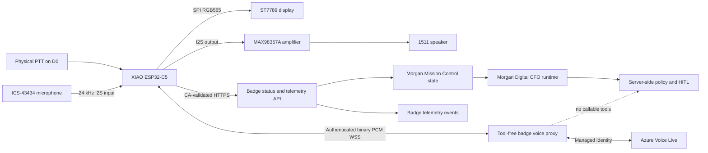
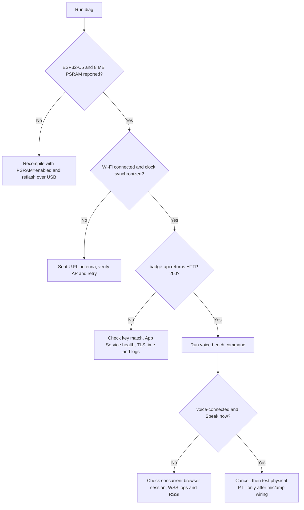

# Morgan Smart ID Badge Prototype Handover

## Document Control

| Field | Value |
| --- | --- |
| Project | Project Solara: Morgan Smart ID Badge & Mission Control |
| Operating chassis | CorpGen v2.6 |
| Repository | `Morgan-D-CFO` |
| Handover date | 2026-07-18 |
| Prototype revision | Rev A core |
| Firmware version | `morgan-badge` 0.1.0 |
| Physical controller | Seeed Studio XIAO ESP32-C5 |
| Cloud host | `morganfinanceagent-webapp.azurewebsites.net` |
| Handover status | Firmware and cloud prototype complete; external modules remain unsoldered |

This document is the consolidated handover for the work completed on the Morgan
physical badge prototype. It records the starting point, decisions, implementation,
deployment, validation evidence, credentials boundary, unresolved risks, and the
next physical bring-up steps.

## Executive Summary

The Morgan repository was already a substantial TypeScript/Azure Digital CFO
application with Mission Control, Agent 365/Teams surfaces, Foundry hosting,
governance, HITL approvals, Voice Live, D-ID avatar support, observability, and
simulated badge experiences. It did not contain real ESP32 firmware when this
work began.

The attached XIAO ESP32-C5 was identified, compiled for, flashed, and exercised
over native USB on `COM7`. A real Rev A badge firmware was created with:

- A cached Morgan portrait for a 240 x 320 ST7789 display.
- `STANDBY -> LISTENING -> THINKING -> SPEAKING` physical states.
- Push-to-talk input.
- Separate I2S microphone input and amplifier output.
- Local fallback behavior when the cloud is unavailable.
- CA-validated HTTPS status and telemetry.
- Authenticated, CA-validated, tool-free Voice Live WebSocket audio.
- Strict separation between wearable presentation and governed finance actions.

A module-level Rev A schematic, point-to-point wiring table, BOM, and safe solder
sequence were also created. The cloud badge API was added to the Morgan App
Service, tested, and deployed.

The external display, microphone, amplifier, speaker, PTT switch, and LiPo are
not soldered. Their electrical behavior is therefore not yet verified. The MCU,
firmware, local state machine, cloud API, telemetry, and badge WebSocket path have
been verified independently.

A deterministic browser component emulator is also available at
`/badge-emulator`. It exercises every Rev A digital component contract plus the
optional PN532, MPU6050, and DRV2605L behavior before soldering.

## Scope And Product Boundary

The target is a **Solara-style Morgan badge prototype**, not an exact hardware
copy of Microsoft's Project Solara reference badge.

Public Project Solara reporting describes a Qualcomm wearable platform running
Microsoft Device Ecosystem Platform (MDEP), an enterprise Android derivative,
with a touchscreen, fingerprint wake, camera, privacy control, Wi-Fi, Bluetooth,
5G, OTA, Intune, Defender, and Entra ID capabilities. Microsoft presents it as a
reference design for partners rather than a retail device.

The current Morgan Rev A implements the subset achievable with the purchased
ESP32 kit:

| Capability | Rev A status |
| --- | --- |
| Wearable portrait display | Implemented in firmware; physical display unsoldered |
| One-press agent wake / PTT | Implemented on `D0`; physical switch unsoldered |
| Microphone capture | Implemented in firmware; ICS-43434 unsoldered |
| Spoken response | Implemented in firmware; MAX98357A and speaker unsoldered |
| Cloud agent handoff | Implemented and verified over HTTPS/WSS |
| Morgan avatar identity | Cached RGB565 portrait implemented |
| Dynamic Imagen avatar generation | Not implemented on device |
| Fingerprint authentication | Not present |
| Camera / visual perception | Not present |
| Touchscreen | Not present |
| 5G | Not present |
| MDEP / Android | Not present; firmware uses Arduino ESP32 core |
| Intune / Defender device management | Not present |
| Entra device identity | Not present; prototype uses a static badge bearer key |

No production claim should describe this ESP32 build as hardware parity with
the Microsoft reference badge.

## Starting Point

At the beginning of this work:

- `badge-simulator/` contained a browser simulator and Morgan portrait.
- `morgan-badge-android/` contained an Android mirror of some badge behaviors.
- The simulator and Android README referenced conceptual C handlers such as
  `mpu6050_motion_int_handler()` and `pn532_isr()`, but those firmware functions
  did not exist in the repository.
- No `.ino`, ESP-IDF project, PlatformIO project, C firmware, or KiCad schematic
  existed for the physical badge.
- The browser simulator modeled more scenes than the Android application.
- Some earlier pin documentation used generic ESP32 GPIO numbers rather than the
  actual XIAO ESP32-C5 pad mapping.
- The proposed audio map placed microphone and amplifier data on one shared wire.
  That was electrically invalid because those signals travel in opposite directions.

The existing simulator and Android directories were already untracked in the
working tree. They were used as behavioral references but were not rewritten as
part of the physical firmware work.

## System Architecture



The badge is a presentation and voice edge client. It does not receive a direct
finance tool capability. Dollar-bearing or mutable actions remain on Morgan's
server-side policy and HITL path.

## Hardware Identification

Windows enumerated the attached device as:

| Property | Verified value |
| --- | --- |
| Serial port | `COM7` |
| USB device | Espressif native USB Serial/JTAG |
| USB vendor/product | `VID_303A`, `PID_1001` during initial enumeration |
| Chip | ESP32-C5 revision 1.0 |
| CPU | Single-core RISC-V, 240 MHz |
| Flash | 8,388,608 bytes |
| PSRAM | 8,388,608 bytes |
| Wireless | Dual-band Wi-Fi 6, Bluetooth LE, IEEE 802.15.4 |

The board's Arduino menu defaults PSRAM to disabled. Every production compile
must include `PSRAM=enabled` in the FQBN.

## Corrected Rev A Pin Map

The actual Seeed XIAO ESP32-C5 pad mapping is used throughout the firmware and
schematic.

| XIAO pad | ESP32-C5 GPIO | Rev A function | Direction |
| --- | ---: | --- | --- |
| `D0` | 1 | PTT switch to ground | Input with pull-up |
| `D1` | 0 | ST7789 CS | Output |
| `D2` | 25 | ST7789 DC | Output |
| `D3` | 7 | MAX98357A SD/MODE | Output |
| `D4` | 23 | ICS-43434 SD | Input |
| `D5` | 24 | Shared I2S LRCLK/WS | Output |
| `D6` | 11 | Shared I2S BCLK/SCK | Output |
| `D7` | 12 | MAX98357A DIN | Output |
| `D8` | 8 | ST7789 SCK | Output |
| `D9` | 9 | Reserved future status LED | Reserved |
| `D10` | 10 | ST7789 MOSI | Output |

### Critical Audio Correction

Only the I2S clocks are shared:

- `D4 / GPIO23` receives microphone data from the ICS-43434.
- `D7 / GPIO12` sends audio data to the MAX98357A.
- `D5 / GPIO24` supplies LRCLK to both modules.
- `D6 / GPIO11` supplies BCLK to both modules.

Joining `MIC_SD` and `AMP_DIN` would place two drivers on one net and cannot
support simultaneous capture and playback.

### Power And Speaker Decisions

- ST7789 and ICS-43434 use the XIAO `3V3` rail.
- MAX98357A uses `VBAT_RAW`, not the XIAO 3.3 V regulator.
- The amplifier has local 100 nF and 100 uF decoupling.
- `SPK+` and `SPK-` are a differential Class-D output pair.
- Neither speaker terminal connects to ground.
- Battery polarity must be verified before connecting the 303040 LiPo.
- The XIAO's battery ADC reports the charger/battery node. A reading near 4 V
  while powered over USB is not proof that a cell is present.

## Schematic Deliverables

| Artifact | Purpose |
| --- | --- |
| `hardware/morgan-badge-rev-a.svg` | Rendered module-level engineering schematic |
| `hardware/morgan-badge-rev-a-wiring.csv` | Machine-readable 22-row point-to-point net table |
| `hardware/README.md` | BOM, critical corrections, caveats, and solder order |

The schematic was parsed as valid XML/SVG, rendered and visually inspected, and
corrected to remove an ambiguous amplifier pull-down crossing. The final sheet is
1800 x 1180 and contains all critical audio, power, and speaker nets.

The exact display and amplifier breakout manufacturer variants were not supplied.
The schematic therefore targets the named module pins and explicitly requires
silkscreen verification before soldering.

The display is assumed to be a 2.0 inch, 240 x 320 ST7789 SPI module with 3.3 V
logic. If its `BL` connection exposes a raw LED rather than an input with an
on-module resistor/driver, a transistor current driver must be added before power.

## Firmware Implementation

### File Map

| File | Responsibility |
| --- | --- |
| `firmware/morgan_badge/morgan_badge.ino` | Setup, state transitions, PTT, serial bench commands, main loop |
| `firmware/morgan_badge/board_config.h` | Exact XIAO pins, timing, display and audio constants |
| `firmware/morgan_badge/badge_types.h` | Badge state definitions |
| `firmware/morgan_badge/badge_display.*` | ST7789 UI, state colors, portrait, pulse and waveform animation |
| `firmware/morgan_badge/badge_audio.*` | Full-duplex I2S, microphone conversion, PCM playback, local tone |
| `firmware/morgan_badge/badge_network.*` | Wi-Fi, NTP, pinned TLS, status, telemetry and WSS client |
| `firmware/morgan_badge/morgan_avatar_rgb565.h` | Generated 168 x 168 RGB565 Morgan portrait |
| `firmware/morgan_badge/tls_root.h` | DigiCert Global Root G2 trust anchor |
| `firmware/morgan_badge/secrets.example.h` | Non-secret local configuration template |
| `firmware/README.md` | Reproducible toolchain, build, flash, diagnostics and security notes |

`firmware/morgan_badge/secrets.h` exists locally but is gitignored and must not
be copied into source control or handover attachments.

### State Machine

| State | Physical behavior | Cloud behavior |
| --- | --- | --- |
| `BOOT` | Initializes serial, ADC, display and I2S | Starts Wi-Fi when configured |
| `STANDBY` | Displays Morgan portrait and status; onboard LED off | Polls status and posts telemetry |
| `LISTENING` | Onboard LED on; microphone streams only while physical PTT is held | Opens tool-free badge WSS |
| `THINKING` | Indigo state presentation | Commits input and requests response |
| `SPEAKING` | Emerald state presentation; PCM routed to amplifier | Receives binary PCM16 chunks |
| `FAULT` | Reports hardware initialization failure | Cloud remains unavailable |

If the physical PTT is used without cloud voice readiness, firmware runs a local
fallback: `LISTENING -> THINKING -> SPEAKING -> STANDBY` and plays a local
confirmation tone when the amplifier is present.

The serial `voice` command opens WSS for bench validation but does not transmit
microphone data. PCM input is gated by the debounced physical `D0` PTT state.

### Display Asset

The existing simulator portrait was inspected as a 640 x 640 32-bit image. A
byte-identical source copy is included at `firmware/assets/morgan-portrait.png`
so a fresh checkout can regenerate the asset without staging the pre-existing
simulator directory. `scripts/prepare-badge-avatar.ps1` center-crops and converts
it to a 168 x 168 RGB565 array:

- Pixel count: 28,224.
- Approximate raw display payload: 56 KB.
- Generated header SHA-256 during validation:
  `221E2BEF1AF58D170C382138A3AE5EAFCD8A07183CC09A97CF688A1C764811FB`.

The badge uses the cached portrait at runtime. Dynamic Imagen generation and
over-the-air portrait replacement remain future work.

### Audio Format

- I2S sample rate: 24,000 Hz.
- MCU I2S slot width: 32 bit, stereo slots.
- Microphone: left slot selected by tying ICS-43434 `L/R` low.
- Cloud input: signed little-endian PCM16 mono.
- Cloud output: signed little-endian PCM16 mono.
- Amplifier output: mono samples duplicated into left and right I2S slots.

Audio quality and bit alignment must be measured after soldering. Bus
initialization alone does not prove that an unwired microphone or amplifier is
present.

## Firmware Toolchain

The Windows development machine was configured with:

| Tool or library | Version |
| --- | --- |
| Arduino CLI | 1.5.1 |
| Espressif Arduino core | `esp32:esp32` 3.3.5 |
| Adafruit ST7735/ST7789 | 1.11.0 |
| Adafruit GFX | 1.12.6 |
| ArduinoJson | 7.4.3 |
| ArduinoWebsockets | 0.5.4 |

The final build command is:

```powershell
arduino-cli compile `
  --fqbn "esp32:esp32:XIAO_ESP32C5:PSRAM=enabled" `
  firmware\morgan_badge
```

The final verified build reported:

- Program storage: 1,343,660 bytes, approximately 40%.
- Internal dynamic memory: 57,092 bytes, approximately 17%.
- External PSRAM: 8 MB enabled and reported on device.

Upload and monitor commands are:

```powershell
arduino-cli upload `
  --port COM7 `
  --fqbn "esp32:esp32:XIAO_ESP32C5:PSRAM=enabled" `
  firmware\morgan_badge

arduino-cli monitor --port COM7 --config baudrate=115200
```

The COM port may change after reset.

## Bench Commands

| Command | Purpose |
| --- | --- |
| `diag` | Chip, memory, power, Wi-Fi, clock, API and voice readiness |
| `wifi` | Non-secret Wi-Fi and cloud readiness |
| `standby` | Force standby |
| `listen` | Force local listening state |
| `think` | Exercise local thinking/speaking return cycle |
| `speak` | Play local tone when amplifier is connected |
| `voice` | Open authenticated WSS without sending microphone PCM |
| `cancel` | Cancel and close WSS |

Serial diagnostics intentionally omit SSID, password, local IP, bearer key, and
Azure credentials.

## Cloud Implementation

### Badge HTTP API

New cloud files:

- `src/badge/badgeAuth.ts`
- `src/badge/badgeRoutes.ts`

Registered routes:

| Route | Behavior |
| --- | --- |
| `GET /api/badge/status` | Returns protocol v1 identity, next action, metrics, voice readiness and poll interval |
| `POST /api/badge/telemetry` | Accepts strict bounded hardware telemetry and records `badge.telemetry` events |
| `GET /api/badge/voice` | Returns HTTP 426 unless upgraded to WebSocket |
| `WSS /api/badge/voice` | Opens the tool-free binary PCM Voice Live session |

HTTP badge routes set `Cache-Control: no-store`.

Telemetry validation is strict and rejects unknown fields. Accepted fields are:

- `deviceId`
- `firmwareVersion`
- `state`
- `batteryVolts`
- `batteryPresence`
- `rssiDbm`
- `freeHeapBytes`
- `psramBytes`
- bounded display, microphone and amplifier readiness values

HTTP badge requests are limited to 120 per minute per badge ID/IP window.

### Badge Authentication

The prototype uses `MORGAN_BADGE_API_KEY`:

- Minimum accepted length is 32 characters.
- Placeholder-looking values are rejected.
- Bearer comparison uses constant-time comparison.
- Missing configuration fails closed with HTTP 503.
- Missing or incorrect credentials return HTTP 401.
- The same credential is required during the WebSocket upgrade.

This is appropriate for a controlled prototype, not a production fleet. A
production design should replace the static shared secret with per-device
identity, rotation, attestation, and preferably mTLS or an Azure IoT/Entra-backed
device authentication path.

### Tool-Free Voice Boundary

The existing browser Voice Live path exposes read and governed finance tools.
Giving that path directly to a wearable would create excessive privilege.

`src/voice/voiceProxy.ts` now distinguishes badge sessions and configures them
with:

- No callable tools.
- `tool_choice: none`.
- No server-side avatar video payload.
- A short spoken-response instruction.
- Explicit refusal to execute work or disclose sensitive finance data.
- Binary PCM output to the badge rather than base64 JSON audio chunks.

Detailed finance questions and actions are directed to authenticated Mission
Control or the normal agent surfaces, where the existing server policy and HITL
controls remain active.

The current proxy has one shared active realtime voice client. Opening a badge
voice session closes any existing browser avatar Voice Live session before the
badge session starts. Do not run badge voice tests during a browser-avatar demo.
Multi-session capacity and fair admission control are future work.

## Component Emulator

The current, firmware-aligned test bench is implemented under
`src/badge-emulator/` and served at `/badge-emulator`. It supersedes the older
browser mock for Rev A component validation.

| Artifact | Responsibility |
| --- | --- |
| `src/badge-emulator/emulator-core.js` | Deterministic component, timing, power, PCM, telemetry, optional-peripheral, and fault model |
| `src/badge-emulator/emulator-ui.js` | Interactive controls, rendering, waveform, audio tone, live health probe, and test presentation |
| `src/badge-emulator/index.html` | Responsive 240 x 320 test-bench interface |
| `src/badge-emulator/README.md` | Coverage, commands, and emulation boundary |
| `src/__tests__/badge-emulator.test.ts` | Rev A pin, timing, audio, power, optional-peripheral, telemetry, and fault tests |

Emulated component groups:

- XIAO ESP32-C5 identity, memory, uptime, state, and user LED.
- ST7789 240 x 320 framebuffer and Morgan portrait.
- ICS-43434 deterministic 24 kHz PCM16, level, noise, clipping, slot, and clock behavior.
- MAX98357A shutdown, gain, I2S, and PCM output behavior.
- Differential 1511 speaker with audible browser tone and open/short faults.
- Active-low D0 PTT with the real 35 ms debounce and cloud/local timing paths.
- 303040 LiPo and SGM40567 USB charge, discharge, state loads, voltage sag, and brownout.
- Wi-Fi association/RSSI, NTP, pinned TLS, badge authentication, API, telemetry, and voice readiness.
- Optional PN532 authorized/denied tags, MPU6050 35-degree motion interrupt, and DRV2605L patterns.

Automated evidence:

- Twelve baseline component groups pass.
- All twenty-four exposed fault controls are injected and detected.
- PTT traverses `LISTENING -> THINKING -> SPEAKING -> STANDBY` with the modeled
  firmware delays.
- Browser tests verified the real portrait and nonblank waveform, individual
  display/NFC/IMU/haptic controls, and public health response.
- Desktop and 390 px mobile views have no page-level overflow or clipped controls.
- Emulator assets are served with `Cache-Control: no-store` so stale test logic
  cannot appear to validate a newer build.

Run locally:

```powershell
npm run test:badge-emulator
npm run build
$env:PORT='3981'
$env:NODE_ENV='development'
node dist\index.js
```

Open `http://localhost:3981/badge-emulator`.

The emulator does **not** prove real voltage levels, signal integrity, RF,
microphone noise/sensitivity, acoustic echo, amplifier distortion, speaker sound
pressure, charger thermals, LiPo protection/capacity, solder quality, or enclosure
reliability. The staged physical bring-up remains mandatory.

### TLS

The deployed App Service certificate chain was inspected and terminated at
DigiCert Global Root G2. That root is embedded in `tls_root.h` and is used for
both HTTPS and WSS. The device synchronizes time over NTP before making TLS
requests.

The trust anchor expires in 2038, but certificate-chain changes must still be
reviewed as part of firmware maintenance. The firmware must never switch to an
insecure TLS mode to work around certificate failures.

## Credential Handling

`scripts/configure-badge.ps1` prompts locally for:

- Wi-Fi SSID.
- A masked Wi-Fi password.

It then generates a random 32-byte badge key and writes:

| Local file | Purpose | Git status |
| --- | --- | --- |
| `firmware/morgan_badge/secrets.h` | Device Wi-Fi, host and badge key | Ignored and untracked |
| `.env.badge.local` | Matching server badge key | Ignored and untracked |

Both paths were checked with `git check-ignore`, and neither is tracked.

Both real local files remain on this development PC so the flashed prototype and
deployed App Service still share a credential. They are not part of the
source-controlled handover. Before transferring a workspace copy, explicitly
exclude both files or delete them and let the receiving owner regenerate new
credentials. Copying the whole working directory can copy ignored files even
though Git will not commit them.

Important operational rule: rerunning `configure-badge.ps1` rotates the local
key immediately. The App Service `MORGAN_BADGE_API_KEY` setting must be updated
to match before the device can authenticate again.

No secret value is included in this handover.

## Azure Deployment

The existing Morgan App Service was updated rather than creating a new Azure
resource.

| Resource | Value |
| --- | --- |
| Subscription | `260948a4-1d5e-42c8-b095-33a6641ad189` |
| Tenant used by Azure Extensions | Contoso, `e4ccbd32-1a13-4cb6-8fda-c392e7ea359f` |
| Resource group | `rg-morgan-finance-agent` |
| Web App | `morganfinanceagent-webapp` |
| Production URL | `https://morganfinanceagent-webapp.azurewebsites.net` |
| Deployment package | `.deploy/morgan-d-cfo-1784399795011.zip` |

Deployment procedure used:

1. Run the full Node build and governance tests.
2. Create the package with `node scripts/deploy-appservice-zip.cjs --package-only`.
3. Verify the package contains `dist/badge/badgeAuth.js`,
   `dist/badge/badgeRoutes.js`, and the updated voice proxy.
4. Set only the `MORGAN_BADGE_API_KEY` App Service setting.
5. Deploy the validated zip synchronously.
6. Preserve the existing `npm start` startup command.
7. Restart and verify the public health endpoint.

The deployment deliberately skipped the script's full settings synchronization,
role reassignment, and auth reconfiguration. That avoided overwriting unrelated
production settings.

App Service reported successful build, startup, and deployment. Post-deployment
verification returned:

- Public health: `healthy`.
- Service: `app-service`.
- Authenticated badge status: HTTP 200.
- Authenticated badge telemetry: HTTP 202.
- Voice contract: `toolsEnabled: false`.
- Voice readiness: configured.

## Validation Evidence

### Repository

| Check | Result |
| --- | --- |
| `npm test` | 20 tests passed, 0 failed |
| Governance and security suite | 11 tests passed |
| Badge emulator suite | 9 tests passed, including 8 component subtests |
| Badge fail-closed authentication test | Passed |
| Strict telemetry unknown-field rejection | Passed |
| Valid telemetry acceptance | Passed |
| Tool-free voice contract assertion | Passed |
| `npm run audit:prod` | 0 vulnerabilities |
| TypeScript language-service errors | None in changed server files |
| `git diff --check` | Passed |

After adding the component emulator, the combined repository command reports 20
passing tests: 11 governance/security tests plus the emulator suite and its
subtests. The focused `npm run test:badge-emulator` command reports nine passing
Node tests, including the eight component-emulator subtests.

### Firmware And Device

| Check | Result |
| --- | --- |
| Exact-target compile | Passed |
| Flash upload | Passed |
| esptool write hashes | Verified |
| ESP32-C5 identity | Verified |
| 8 MB flash | Verified |
| 8 MB PSRAM | Verified with `PSRAM=enabled` |
| Battery/charger ADC | Active; approximately 3.9-4.0 V on USB, presence unverified |
| Local state cycle | `LISTENING -> THINKING -> SPEAKING -> STANDBY` verified |
| Onboard LED | State-controlled and observed through the live cycle |
| Wi-Fi association | Verified during successful runs |
| NTP | Synchronized during successful runs |
| HTTPS badge status | HTTP 200 from XIAO during successful runs |
| Telemetry | HTTP 202 from XIAO during successful runs |
| Badge WSS | Reached `voice-connected` and `Speak now` |
| WSS close | Clean intentional cancel verified |

Representative sanitized device trace:

```text
{"event":"BOOT","firmware":"morgan-badge","version":"0.1.0","chip":"ESP32-C5","cpuMHz":240,"flashBytes":8388608,"psramBytes":8388608}
{"event":"NET","status":"badge-api","httpCode":200,"authenticated":true,"voiceConfigured":true}
{"event":"NET","status":"telemetry","httpCode":202}
{"event":"STATE","state":"LISTENING","reason":"Connecting voice"}
{"event":"NET","status":"voice-connected"}
{"event":"STATE","state":"LISTENING","reason":"Speak now"}
{"event":"NET","status":"voice-disconnected","intentional":true,"reason":""}
{"event":"STATE","state":"STANDBY","reason":"Voice cancelled"}
```

### Hardware Artifacts

| Check | Result |
| --- | --- |
| Schematic XML/SVG parse | Passed |
| Full-sheet visual render | Inspected |
| Wiring CSV parse | 22 rows |
| Required nets | Present |
| Avatar header | 28,224 RGB565 values |
| Credential files | Ignored and untracked |

## Troubleshooting History And Decisions

### WebSocket Client

The first client library tested was Links2004 `WebSockets` 2.7.2. Several issues
were isolated:

1. Calling `setAuthorization()` before `beginSslWithCA()` lost the authorization
   header because client initialization cleared it.
2. An extra CRLF in the custom badge header terminated the upgrade request before
   the bearer header. App Service logs showed HTTP 401 for those requests.
3. After correcting the request, the library still timed out reading the upgrade
   response on ESP32-C5.

The exact request was replayed from Node over validated TLS and returned
`HTTP/1.1 101 Switching Protocols`, proving the server route and request shape.
The repository's Node `ws` client also opened and closed the endpoint cleanly.

The firmware was therefore switched to `ArduinoWebsockets` 0.5.4. The actual
XIAO then emitted `voice-connected` and reached `Speak now`. Keep the replacement
library unless the original client gains verified ESP32-C5 support.

### Wi-Fi Stability

Loose-board RSSI varied substantially, with successful readings ranging roughly
from -87 dBm to -57 dBm. The board also experienced periods where association
was unavailable and entered its retry loop.

An attempted manual auto-reconnect override triggered an ESP32-C5 dual-band core
warning and was reverted. The final firmware retains the previously verified
connection behavior.

At the end of the last live demonstration on 2026-07-18, the local state machine
and board diagnostics were working, but Wi-Fi was disconnected and retrying.
This does not invalidate the earlier HTTPS/WSS proof; it does mean antenna and
access-point availability must be resolved before relying on realtime voice.

Immediate radio actions:

1. Seat the supplied U.FL antenna squarely until it clicks.
2. Keep the antenna clear of the display flex, LiPo, speaker wires, metal tools,
   and the user's hand during tests.
3. Confirm the configured network is available and permits the XIAO's selected
   2.4/5 GHz band.
4. Use `wifi` or `diag` and target a stable RSSI better than approximately -70 dBm
   before testing realtime PCM.

### Quick Diagnostic Flow



## Current Physical State

At handover:

- The XIAO ESP32-C5 is attached over USB and contains the final Rev A firmware.
- The firmware includes the real Morgan RGB565 portrait.
- The board is left in standby/retry behavior with no serial monitor holding the port.
- Local state transitions and onboard LED behavior work.
- The badge cloud API is deployed and healthy.
- The most recent live radio check was disconnected/retrying.
- No external badge module has been soldered.
- No LiPo has been connected or validated by this work.
- No display pixel, microphone, amplifier, speaker, PTT, or charger-path test has
  been performed on assembled hardware.

## Safe Physical Bring-Up

Follow `hardware/README.md` and the schematic. The condensed sequence is:

1. Photograph and identify both sides of every purchased module.
2. Confirm display pin labels/resolution, speaker impedance, and LiPo polarity.
3. Seat and position the U.FL antenna.
4. Disconnect USB and battery before soldering.
5. Solder ground and power first; inspect and resistance-test for shorts.
6. Add ST7789 and local decoupling; test over USB before audio.
7. Add ICS-43434 and its damping/decoupling parts; keep its port unobstructed.
8. Add MAX98357A and bulk decoupling; measure supply and shutdown before speaker.
9. Connect the differential speaker last and keep its twisted pair away from mic/RF.
10. Add PTT between `D0` and ground.
11. Re-run all USB tests.
12. Connect the protected LiPo only after USB-powered validation, with USB unplugged.

Use a current-limited supply where possible. Do not solder to a connected,
unprotected, damaged, or swollen LiPo.

### Post-Solder Electrical Verification

Run these checks after each subsystem is added, before proceeding to the next:

| Stage | Power state | Required checks |
| --- | --- | --- |
| Bare wiring | Unpowered | Inspect polarity and solder bridges; verify `3V3-GND` and `VBAT_RAW-GND` are not near-zero-ohm shorts. Capacitor charging means resistance may rise rather than stay fixed. |
| Display fitted | USB only, battery absent | Confirm approximately 3.3 V at display VCC, no hot parts, normal serial boot, correct orientation, full portrait, and stable backlight. |
| Microphone fitted | USB only | Confirm approximately 3.3 V at VDD, clean BCLK/LRCLK with a scope or logic analyser, expected left-slot samples, and no clipping at normal speech level. |
| Amplifier fitted, no speaker | USB plus appropriate `VBAT_RAW` source | Confirm amplifier VIN matches the intended battery rail, SD is low in standby, quiescent current is reasonable for the exact module, and no output terminal is shorted to ground. |
| Speaker fitted | Current-limited power | Confirm speaker impedance before connection, low-volume tone first, no excessive heating, and twisted differential speaker wiring. |
| PTT fitted | USB only | Confirm released input is high, pressed input is low, state changes occur once per press/release, and serial `voice` alone does not stream microphone PCM. |
| LiPo fitted | USB disconnected for soldering | Reconfirm polarity, insulate joints, observe first charge under supervision, verify USB/battery transition, and stop on heat, swelling, smell, or unstable voltage. |

There is no universal resistance or current pass value for unidentified breakout
variants. Compare measurements with the exact module datasheets before accepting
the assembly.

## Remaining Work

### Priority 0: Before Soldering

- Identify exact display breakout and confirm whether `BL` is logic-safe at 3.3 V.
- Confirm speaker impedance and rated power.
- Confirm LiPo protection and polarity.
- Reseat and validate the U.FL antenna with stable RSSI.
- Review the point-to-point wiring CSV against physical silkscreens.

### Priority 1: Core Hardware Bring-Up

- Solder and test the display only.
- Confirm portrait orientation, ST7789 offsets, reset behavior, and backlight current.
- Solder microphone and inspect I2S samples for DC bias, clipping and channel slot.
- Solder amplifier without speaker and verify shutdown/current behavior.
- Add speaker and tune software output gain.
- Add PTT and verify debounce plus physical press/release behavior.
- Add LiPo last and validate charging, USB/battery transition, temperature and runtime.

### Priority 2: Firmware Hardening

- Add peripheral-specific self-tests with real readback where possible.
- Add measured battery-presence and calibrated percentage logic.
- Add display sleep/backlight control and deep-sleep wake strategy.
- Add OTA with signed images, secure boot, and flash encryption policy.
- Replace static device secret with per-device identity and rotation.
- Add bounded PCM buffering and backpressure measurements under weak Wi-Fi.
- Add explicit Wi-Fi event telemetry and reconnect tests for dual-band ESP32-C5.
- Add a watchdog and brownout/recovery test matrix.

### Priority 3: Solara-Parity Expansion

- Design Rev B around actual PN532, MPU6050, and DRV2605L module dimensions.
- Avoid consuming rear JTAG pads until debug and low-power bring-up is complete.
- Add privacy-visible recording indication and hardware microphone disable.
- Add touch/fingerprint/camera only with a larger platform and enterprise device
  management plan.
- Define consent, recording retention, Purview, and workplace privacy controls.
- Add dynamic cloud portrait delivery with signed/cacheable assets rather than
  running image generation on the MCU.

## Ownership To Assign Before Pilot

Named owners were not provided during prototype development. Assign these roles
before the badge is enclosed or used outside the bench:

| Ownership area | Required responsibility |
| --- | --- |
| Embedded firmware owner | Arduino/Espressif updates, TLS root maintenance, signed OTA, power management, audio and watchdog testing |
| Hardware owner | Module identification, schematic revision control, solder/inspection quality, LiPo safety, RF and enclosure validation |
| Cloud owner | App Service deployment, badge API availability, Voice Live capacity, logs, rate limits and credential rotation |
| Security owner | Device identity roadmap, secret handling, secure boot/flash encryption, threat model and incident response |
| Privacy/compliance owner | Recording consent, retention, Purview policy, workplace monitoring controls and visible privacy indicators |

Until those assignments are made, the repository owner is the coordination point
but should not be treated as having accepted every specialist responsibility.

## Known Risks And Limitations

| Risk | Impact | Mitigation |
| --- | --- | --- |
| External modules unsoldered | No end-to-end physical display/audio proof | Bring up one subsystem at a time |
| Exact breakout variants unknown | Pin/power assumptions may differ | Verify silkscreen and datasheet before soldering |
| Variable Wi-Fi/RSSI | Realtime audio can stall or disconnect | Seat antenna, improve placement, test band/AP |
| Static bearer key in firmware | Lost badge could access prototype routes | Rotate key; migrate to per-device identity |
| One active Voice Live client | Badge can displace browser avatar | Add session admission/capacity policy |
| Root CA embedded in firmware | Trust-chain maintenance required | Review before expiry/chain changes; add OTA |
| No secure boot/flash encryption | Firmware and local key not production-hardened | Enable in production hardware plan |
| No OTA | Physical USB needed for updates | Add signed OTA before enclosed pilot |
| Battery presence unverified | Voltage can be misinterpreted | Add calibrated presence/gauge logic |
| No privacy hardware switch | Recording trust gap | Add hard mic disable and visible indicator |
| Optional modules omitted | NFC/IMU/haptics unavailable | Design Rev B daughterboard after core proof |

## Git And Workspace State

No Git commit or branch was created.

Tracked files changed by this work:

- `.gitignore`
- `src/index.ts`
- `src/voice/voiceProxy.ts`
- `src/observability/agentEvents.ts`
- `src/__tests__/governance.test.ts`

New source-controlled deliverables intended for review:

- `src/badge/`
- `src/badge-emulator/`
- `firmware/`
- `hardware/`
- `scripts/configure-badge.ps1`
- `scripts/prepare-badge-avatar.ps1`
- `docs/morgan-smart-badge-handover.md`

Existing untracked directories that predated this physical implementation:

- `badge-simulator/`
- `morgan-badge-android/`

Review those existing directories separately before staging a commit. Do not use
`git add .` without inspecting the resulting staged set.

Ignored local/runtime artifacts include:

- `firmware/morgan_badge/secrets.h`
- `.env.badge.local`
- `.deploy/`
- `dist/`

## Operational Runbook

### Rebuild Firmware

```powershell
.\scripts\prepare-badge-avatar.ps1

arduino-cli compile `
  --fqbn "esp32:esp32:XIAO_ESP32C5:PSRAM=enabled" `
  firmware\morgan_badge
```

### Flash And Inspect

```powershell
arduino-cli board list

arduino-cli upload `
  --port COM7 `
  --fqbn "esp32:esp32:XIAO_ESP32C5:PSRAM=enabled" `
  firmware\morgan_badge

arduino-cli monitor --port COM7 --config baudrate=115200
```

Run `diag`, then test `listen`, `think`, `voice`, and `cancel` as appropriate.
Do not use physical audio tests until the modules and speaker are wired correctly.

### Reconfigure Local Wi-Fi And Badge Key

```powershell
.\scripts\configure-badge.ps1
```

Credential rotation sequence:

1. Stop active badge voice testing.
2. Run `configure-badge.ps1` and enter Wi-Fi values only in the local terminal.
3. Confirm `secrets.h` and `.env.badge.local` remain ignored and untracked without
  printing their contents.
4. Update only the App Service `MORGAN_BADGE_API_KEY` setting through Azure Portal,
  an approved secret pipeline, or a future Key Vault reference.
5. Restart the App Service if the settings operation does not do so automatically.
6. Reflash the firmware generated with the new local header.
7. Verify public health, then authenticated status HTTP 200, telemetry HTTP 202,
  and a clean WSS open/cancel.
8. Revoke/delete superseded local copies and record the rotation date without
  recording the secret value.

Do not place the key directly in documentation, shell history, process listings,
Git, deployment logs, or screenshots.

### Validate Server

```powershell
npm test
npm run test:badge-emulator
npm run audit:prod
```

### Package App Service

```powershell
node scripts\deploy-appservice-zip.cjs --package-only
```

Review the generated package before deploying. Avoid a full production settings
sync unless all environment values have been deliberately reviewed.

### Verify Live Health

```powershell
Invoke-RestMethod `
  -Uri 'https://morganfinanceagent-webapp.azurewebsites.net/api/health'
```

Authenticated badge endpoints require the local badge key and must be tested
without printing the authorization header.

## Acceptance Checklist

- [x] Project and existing badge simulations understood.
- [x] Attached board identified as ESP32-C5.
- [x] Exact board toolchain installed.
- [x] Board-only diagnostic compiled, flashed, and read over USB.
- [x] 8 MB PSRAM explicitly enabled and verified.
- [x] Invalid shared I2S data wiring corrected.
- [x] Rev A schematic produced and visually inspected.
- [x] Point-to-point wiring CSV produced and parsed.
- [x] Firmware state machine implemented.
- [x] Morgan portrait converted and embedded.
- [x] Local fallback exercised.
- [x] Secure badge status and telemetry API implemented.
- [x] Tool-free badge Voice Live path implemented.
- [x] Badge API deployed to existing App Service.
- [x] HTTPS 200 and telemetry 202 proven from XIAO.
- [x] Authenticated WSS `Speak now` proven from XIAO.
- [x] Deterministic component emulator implemented at `/badge-emulator`.
- [x] Twelve baseline component groups validated in Node and browser.
- [x] All twenty-four exposed fault controls injected and detected.
- [x] Desktop/mobile emulator layouts and live public health probe validated.
- [x] Cloud and governance tests passed.
- [x] Production dependency audit passed with zero vulnerabilities.
- [x] Secrets confirmed ignored and untracked.
- [ ] U.FL antenna/RSSI made consistently reliable.
- [ ] Display soldered and pixel-tested.
- [ ] Microphone soldered and audio-capture tested.
- [ ] Amplifier/speaker soldered and playback-tested.
- [ ] Physical PTT soldered and tested.
- [ ] LiPo soldered, charged, and runtime-tested.
- [ ] Enclosure and thermal/mechanical validation completed.

## Primary References

Repository references:

- `firmware/README.md`
- `hardware/README.md`
- `hardware/morgan-badge-rev-a.svg`
- `hardware/morgan-badge-rev-a-wiring.csv`
- `src/badge/badgeAuth.ts`
- `src/badge/badgeRoutes.ts`
- `src/badge-emulator/README.md`
- `src/voice/voiceProxy.ts`
- `src/__tests__/governance.test.ts`

External references consulted:

- Seeed Studio XIAO ESP32-C5 getting-started documentation, pin map, battery ADC,
  battery wiring, deep-sleep guidance, and official schematic resources.
- ICS-43434 microphone documentation.
- MAX98357A amplifier documentation.
- Waveshare-style 2.0 inch ST7789 module documentation for the working display
  assumption and 240 x 320 geometry.
- Public Project Solara reporting and Microsoft Device Ecosystem Platform context.
- The STRATODEAN GPS tracker article as the requested schematic presentation reference.

## Handover Conclusion

The software and cloud foundation for the Morgan Rev A physical badge is in
place, flashed to the attached XIAO ESP32-C5, and backed by a complete module-level
schematic and bring-up plan. The next owner should not redesign the core pin map
or weaken the cloud trust boundary before hardware bring-up. The immediate focus
is antenna reliability, exact module identification, and subsystem-by-subsystem
soldering and measurement.
